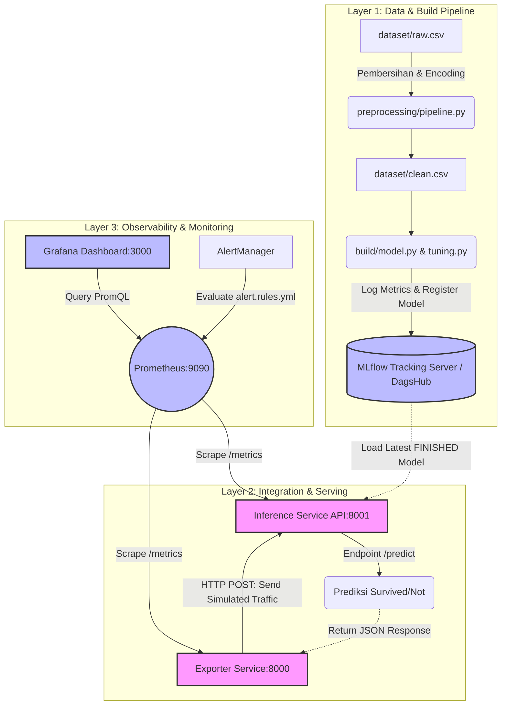
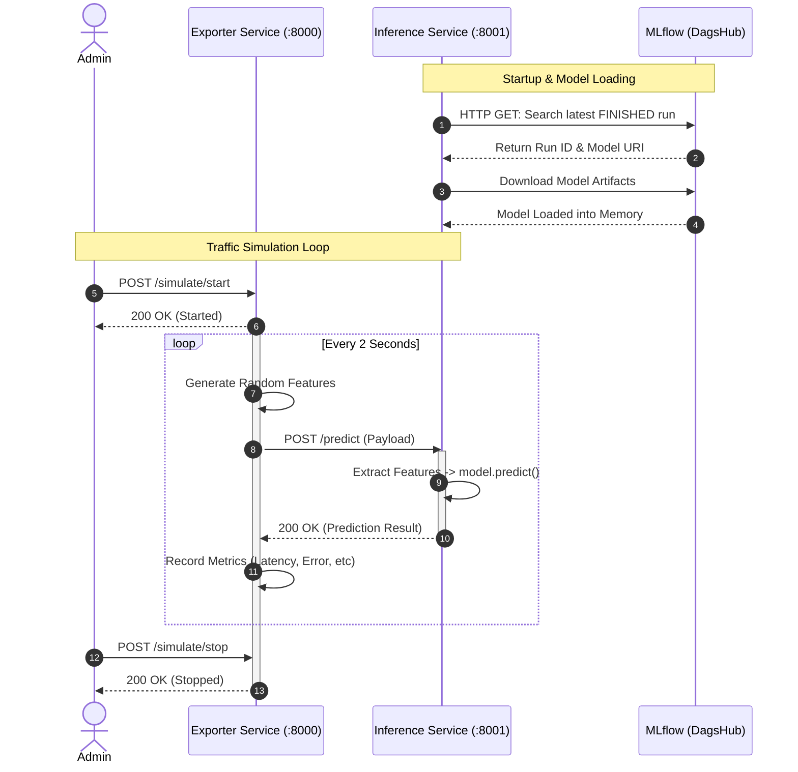

# Arsitektur Sistem
Sistem ini memecah kompleksitas menjadi 3 layer fundamental yang saling terisolasi namun terintegrasi:

## 1. Data & Build Layer (`/preprocessing` & `/build`)
* **Data Pipeline (`pipeline.py`)**: Bertugas memuat data mentah (`raw.csv`), melakukan pembersihan data (imputasi *missing values* pada `Age` dan `Embarked`), dan *One-Hot Encoding*. Menghasilkan `clean.csv`.
* **Model Training (`model.py` & `tuning.py`)**: Melatih model klasifikasi *Random Forest*. Modul `tuning.py` menerapkan *GridSearchCV* untuk optimasi *hyperparameter*. Model terbaik, metrik (akurasi, presisi, recall), dan parameter dicatat (*logged*) secara otomatis ke remote server **MLflow (DagsHub)**.

## 2. Integration & Serving Layer (`/integration`)
Layer ini adalah jantung dari aplikasi *production*:
* **Inference Service (`inference.py` - Port 8001)**: Sebuah REST API (Flask) yang secara dinamis mengunduh model dengan status *FINISHED* terbaru dari MLflow. Jika koneksi atau model gagal dimuat, sistem memiliki *fallback* untuk berjalan di **mode simulasi** sehingga layanan tidak *crash*. Menyediakan endpoint `/predict` dan metrik performa `/metrics`.
* **Exporter Service (`exporter.py` - Port 8000)**: Layanan pendamping yang berjalan di *background thread*. Fungsinya adalah mengirimkan *payload* data penumpang acak ke Inference Service. Ini sangat krusial untuk mensimulasikan *traffic real-time* agar metrik di Grafana bisa divisualisasikan tanpa menunggu *traffic* pengguna asli.

## 3. Monitoring & CI/CD Layer
* **Prometheus & Grafana**: Prometheus (Port 9090) melakukan *scraping* metrik (RPS, Latensi, Error Rate, CPU/RAM) dari Inference dan Exporter. Grafana (Port 3000) memvisualisasikan data ini ke dalam *dashboard* terpusat. Dilengkapi juga dengan `alert.rules.yml` untuk memicu peringatan jika sistem *down* atau latensi memburuk.
* **GitHub Actions**: Memastikan kualitas (*Linting* Flake8, Black) dan menguji fungsionalitas kode secara otomatis setiap kali ada *Push* atau *Pull Request* ke branch `main`.

## Flowchart Sistem

# Flowchart Interaksi API

Alur komunikasi antara User, Exporter, Inference, dan MLflow.

